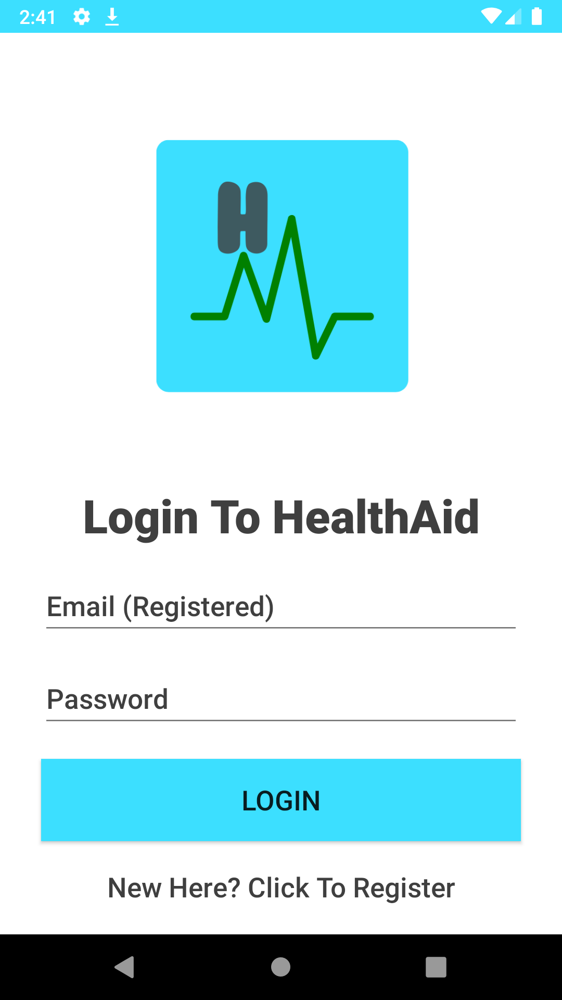
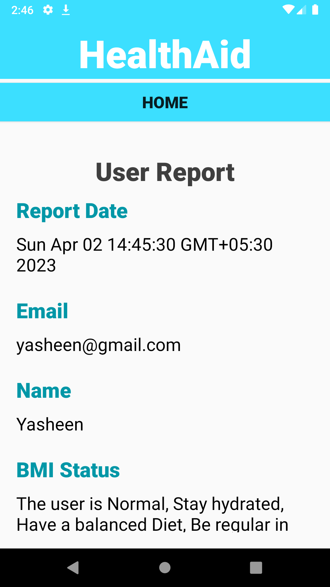
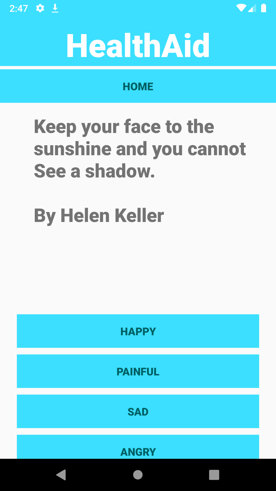
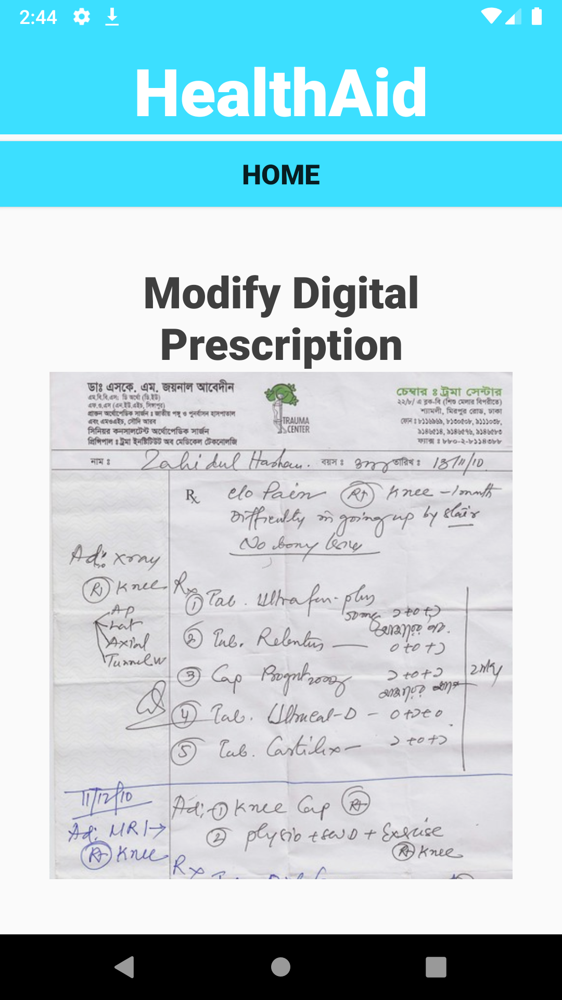
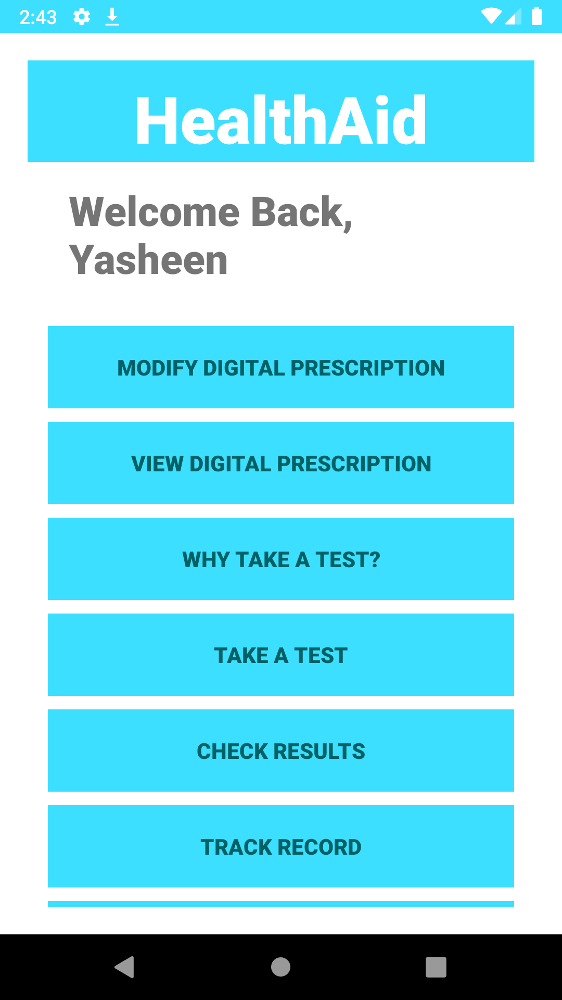

# HealthAid-Android

Health Aid is a smart diagnostic tool that can diagnose/identify the possible health conditions the person may have or is likely to possess in the near future.

## Problem Statement

In the modern era, physical and mental well - being of an individual is very crutial
in the fast pacing world. The lack of awareness about the ill effects of the
sedentary lifestyle causes a major issue in their later life. According to the National
Centre of Biotechnology information, the percentage of overweight has drastically
increased from eight percent to more than fourteen percent since nineteen ninety
eight. The obesity rate has increased from two percent to five percent during the
same duration as mentioned above. This is a concerning issue for the nation. This
research paper deals with an application which was developed to focus on the
physical and the mental well being of the individual. The application gathers input
such as height weight and blood pressure and calculates their Body Mass Index and
their Mean arterial pressure to display findings about their health

## Modules

### 1. Accounts Module

The registration module involves in
creating a new user and creating an
instance in the database of the
application. The Login module verifies
the user and directs the user to the
boot page of the application.

### 2. Tests & Results Module

This module gathers various input of
the user such as height, weight and
age and calculates the body mass
index of the user. The second test the
user undergoes is the test for blood
sugar and blood pressure.

### 3. Mental-wellness module

This module helps in improving the mental wellness of
a person. The module has two core functionalities
namely mindfulness and positivity. Mindfulness is the
act of being conscious or being aware. The app sets a
track according to the users preferences and let them
be mindful. The positivity application gets the mood
of the person and displays positive quote and articles
to improve the overall morale of the user.

### 4. Prescription Module

The prescription module involves in
uploading a digital version of a signed
prescription. This feature helps in
purchasing medicines that require the
prescription of the doctor.

### 5. Miscellaneous module

This module has miscellaneous layouts
such as the boot screen after the user
login, Links to safety health portal and
answers to general questions
